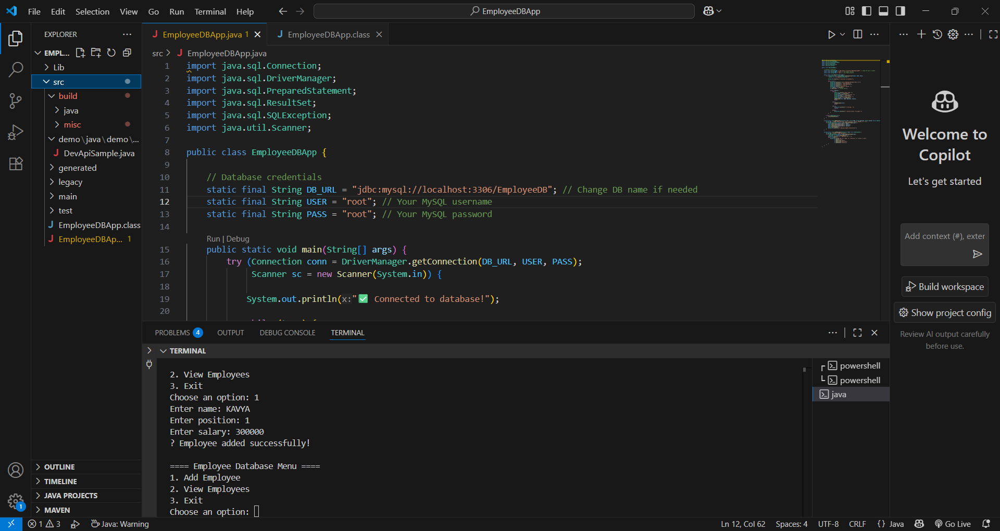

# EmployeeDBApp  

## 📖 Description  
A simple Java application to manage employee records using a MySQL database connection.  

## 🚀 Features  
- Add employee details to the database  
- View all employee records  
- Simple console-based menu interface  

## 🛠 Requirements  
- Java (JDK 8 or above)  
- MySQL Server installed  
- MySQL Connector JAR file (`mysql-connector-j-9.4.0.jar`)  


## ⚙️ How to Run  
1. **Compile the Java file**  
   ```bash
   javac -cp "lib/mysql-connector-j-9.4.0.jar;." EmployeeDBApp.java

2. **Run the application**
   ```bash
   java -cp "lib/mysql-connector-j-9.4.0.jar;." EmployeeDBApp

## Follow the menu

1.Choose 1 to add an employee

2.Choose 2 to view employees

3.Choose 3 to exit

## 📸 Screenshot  
  

**Made with ❤️ by Kavyakambhampati**
